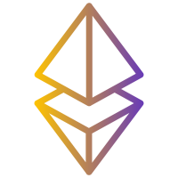

# blockchain-developer-bootcamp-final-project

ConsenSys Academy Final Project

##  <a href="https://etherpreneur.herokuapp.com/"> EtherPreneur </a>

### Ether donate or not

An Ethereum based platform where a user (let's call him a Visioner) can post his idea/vision/project for something and define the amount of capital he needs to achieve it.
Other users can invest.

<ul>
  <li>A Visioner can upload his vision and check its status and the capital amount collected.</li>
  <li>Users can invest to one or more ideas and browse through a list to available ones.</li>
  <li>Once the requested capital is achieved, no more investments are being accepted.</li>
  <li>If the requested amount is not completed, the funds are returned.
</ul>

### Available Actions

#### Every user

<ul>
    <li>Create a Vision</li>
    <li>Invest to a Vision, as long as he's not the creator of it.</li>
    <li>View all available Visions.</li>
</ul>

#### Vision Owner

<ul>
  <li>After the amount goal is reached:</li>
    <ul>
        <li>Create a withdraw request.</li>
        <li>Withdraw the requested amount if the appropriate amount of votes is collected.</li>
    </ul>
</ul>

#### Vision Investors

<ul>
    <li>Vote for a Withdrawal Request, if and only if they have invested to its Vision.</li>
    <li>Withdraw their invest amount if the Vision is expired and the amount goal was not met.</li>
</ul>

#### Deployed on heroku: https://etherpreneur.herokuapp.com/

### How to run the project locally

#### 🔌 Prerequisites

<ul>
<li>npm 8.1.2</li>
<li>Node.js v16.8.0</li>
<li>Ganache CLI v6.12.2 </li>
<li>Truffle v5.4.15 </li>
<li>Solidity - 0.8.0 (solc-js) </li>
<li>Web3.js v1.5.3 </li>
</ul>

#### 🔹 Contract deployment

<ul>

<li> Install truffle and ganache-cli</li>

    npm install -g truffle
    npm install -g ganache-cli

<li> Create a .env file in the project root directory where you are going to set the deployed contract address:

    ETHERPRENEUR_ADDRESS=YOUR_DEPLOYED_ADDRESS

For Rinkeby network create a new project on Infura and add the following too:

    MNEMONIC="YOUR_RINKEBY_ACCOUNT_MNEMONIC" //account /w Eth is needed
    INFURA_URL="YOUR_INFURA_URL_ON_RINKEBY"

</li>
<li>Open a terminal and run

    ganache-cli

</li>
<li>On another terminal run:

    truffle compile
    truffle migrate --network development (for ganache) or
    truffle migrate --network rinkeby (for rinkeby testnet)

</li>
<li>Get the deployed contract address and fill the .env file.</li>

</ul>

#### 🔹 Frontend deployment

<ul>
    <li>Clone the project.</li>
    <li>

    npm install

</li>
<li>

    npm run dev

</li>
<li> Open http://localhost:3000/ </li>
<li>Connect Metamask to the network that contract was deployed and play around :)</li>
</ul>

### :shipit: Run the tests

For development mode you have to run <b>ganache-cli</b> first and then:

    truffle test

For rinkeby:

    truffle test --network rinkeby

### 🎥 Walktrhough video:

https://www.loom.com/share/47d450833b074e8fae17f3d202a5c2fa

### Public Address for verification:

<b>0x2A6537B676E5124395390050DCefb696b7F5eE29</b>

###### Created for the purposes of blockchain developer bootcamp 💙
